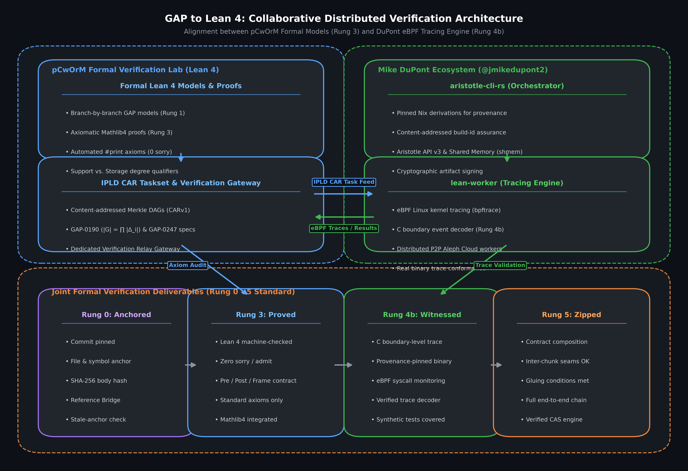
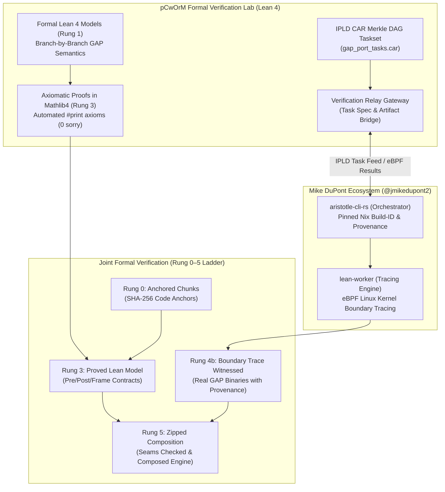

# Joint Distributed Formal Verification Architecture
**Standard:** Shared Terminology Guide v2 (DuPont–Dağlı Specification)  
**Collaborators:** Volkan Dağlı (@pCwOrM) & Mike DuPont (@jmikedupont2)  
**Repository:** [pCwOrM/gap-lean4-port](https://github.com/pCwOrM/gap-lean4-port)  
**Status:** Active Architectural Alignment  

---

## 1. Architectural Overview

To formally verify computational discrete algebra from the **GAP (Groups, Algorithms, Programming)** system without claiming premature verification of raw C/GAP code, we divide the verification workload into complementary, verifiable strata according to the **Rung 0–5 Ladder**:

---

## 2. Separation of Responsibilities

### Layer A: Formal Modeling & Axiomatic Proofs (pCwOrM Lab)
- **Lean 4 Models (Rung 1):** Faithfully mirror GAP C/kernel and library algorithms branch-by-branch.
- **Axiomatic Proofs (Rung 3):** Prove mathematical contracts with zero `sorry` or `admit`, audited by `RequestProject/Verify.lean` under standard foundations (`propext`, `Classical.choice`, `Quot.sound`).
- **Degree Qualification:** Permutation degrees are explicitly separated into **Support degree** ($\text{LargestMovedPoint}$) and **Storage degree** (array length).
- **Task Merkle Trees:** Chunks and estimations are indexed in IPLD CARv1 Merkle DAGs (`tasks/gap_port_tasks.car`).

### Layer B: Reproducible Provenance & Runtime Tracing (Mike DuPont)
- **Pinned Nix Derivations (`aristotle-cli-rs`):** Provide reproducible builds with cryptographic `build-id` and provenance tracking.
- **eBPF Boundary Tracing (`lean-worker`):** Traces actual GAP binary execution at the C function boundary (Rung 4b) via Linux kernel eBPF probes (`bpftrace`), verifying trace decoders against the Lean 4 contracts.
- **P2P Aleph Cloud Workers:** Distribute verification and tracing tasks across decentralized worker nodes.

### Layer C: Composition & Zipping (Rung 5)
- **Inter-Chunk Seams:** Contracts compose across callers and callees, verifying gluing conditions and ensuring end-to-end correctness of computational discrete algebra algorithms.

---

## 3. Security, Privacy & Invariant Protections

1. **Frozen Artifacts:** Existing milestone write-ups and completed proofs (Release v0.2.0, Zenodo DOI: [10.5281/zenodo.23045504](https://doi.org/10.5281/zenodo.23045504)) remain immutable.
2. **Branch Protection:** All collaborative integrations land via feature branches and pull requests subject to review.
3. **Gateway Isolation:** External tracing and worker communication routes exclusively through designated relay nodes, keeping internal development infrastructures completely isolated.
