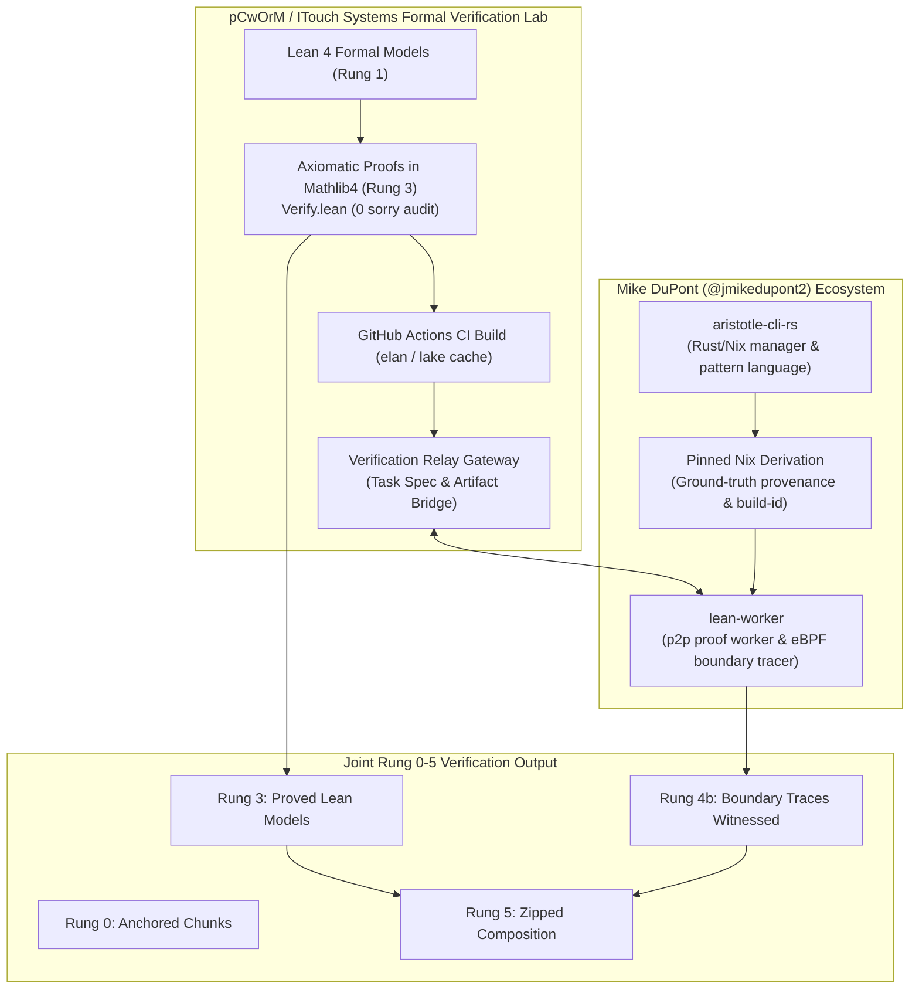

# Formal Verification Ledger (Rung 0–5 Specification)
**Standard:** Shared Terminology Guide v2 (DuPont–Dağlı Specification)  
**Repository:** `pCwOrM/gap-lean4-port`  
**CI Status:**   
**Axiomatic Baseline:** Zero `sorry`, standard Lean 4 axioms (`propext`, `Classical.choice`, `Quot.sound`)  
**Frozen Release:** v0.2.0 (Zenodo DOI: [10.5281/zenodo.23045504](https://doi.org/10.5281/zenodo.23045504), arXiv: [arXiv:2609.38492](https://arxiv.org/abs/2609.38492))

---

## 1. The Rung Verification Scale

In accordance with the **Shared Terminology Guide v2**, we make no premature claim that "GAP is verified." Every chunk reports the precise rung reached on the ladder:

| Rung | Name | Operational Definition | Verification Authority |
| :---: | :--- | :--- | :--- |
| **0** | **Anchored** | Chunk pinned to commit, file, symbol, line range, and SHA-256 body hash. | Machine Anchor (Reference Bridge $\mathcal{R}$) |
| **1** | **Modeled** | Lean 4 model exists, mirrors control-flow/data structures branch-by-branch, type-checks. | Lean 4 Compiler (`lake build`) |
| **2** | **Reviewed** | Named GAP / CAS core developer signs off on model-to-code correspondence. | Human Expert Review |
| **3** | **Proved** | Contract formally proved for the model in Lean 4 without `sorry`; `#print axioms` audited. | Lean 4 Kernel (`Verify.lean`) |
| **4a** | **Witnessed (operator)** | Traces of a GAP-level operation (e.g. `*`, `Size`, `Orbit`) satisfy the contract. | GAP Testsuite / CI Harness |
| **4b** | **Witnessed (boundary)** | Traces at the C/Kernel function boundary with recorded provenance (Nix derivation build-id). | Mike's `lean-worker` / eBPF Probe |
| **5** | **Zipped** | Contract composes with callers and callees with verified seams. | Inter-chunk Composition Engine |

---

## 2. Active Verification Matrix & Chunk Ledger

### Phase 1 & 2 Locked Chunks (Release v0.2.0 - Frozen & Audited)

| Chunk ID | Source File (GAP Anchor) | Target Lean Model | Key Proved Contract / Property | Degree Qualifier | Current Rung | Axioms Rollup |
| :--- | :--- | :--- | :--- | :--- | :---: | :--- |
| **GAP-0050** (`GAP-Kernel-ProdPerm`) | `src/permutat.cc` `ProdPerm` (`T_PERM`) | `RequestProject.Gap.Permutation` | Permutation image-array memory model; anti-homomorphism to Mathlib `Equiv.Perm` (`toEquivPerm_mul`); shortcut operand reuse frame. | **Support degree** (`largestMovedPoint`) vs **Storage degree** (`degree`) | **Rung 3 (Proved)** | `propext` `Classical.choice` `Quot.sound` (0 sorry) |
| **GAP-0331** | `lib/zmodnz.gi` `InverseOp` | `RequestProject.Gap.Library.Zmodnz` | Bijective ring isomorphism $\mathbb{Z}/n\mathbb{Z} \cong \text{ZMod } n$; constructive Bézout inverse soundness. | Algebraic (Ring) | **Rung 3 (Proved)** | `propext` `Classical.choice` `Quot.sound` (0 sorry) |
| **GAP-0299** | `lib/stbc.gi` `StabChainOp`, `SiftedPerm` | `RequestProject.Gap.Library.Stbc` | Schreier-Sims stabilizer chain sifting soundness & completeness; base-point fixation invariant. | **Support degree** ($\max \Omega$ moved) vs **Storage degree** | **Rung 3 (Proved)** | `propext` `Classical.choice` `Quot.sound` (0 sorry) |
| **GAP-0332a** | `lib/partitio.gi` `splitCellByPred` | `RequestProject.Gap.Library.Partitio` | Backtrack partition cell splitting: pointwise conservation (`mem_splitCellByPred_iff`), mutual disjointness, length preservation. | Poset / Set Partition | **Rung 3 (Proved)** | `propext` `Classical.choice` `Quot.sound` (0 sorry) |
| **GAP-0332b** | `lib/zmodnze.gi` Cyclotomic extensions | `RequestProject.Gap.Library.Zmodnze` | Cyclotomic extension ring cardinality: $\lvert \mathbb{Z}/n\mathbb{Z}(\varepsilon_m) \rvert = n^m$; ring homomorphism soundness. | Ring Extension | **Rung 3 (Proved)** | `propext` `Classical.choice` `Quot.sound` (0 sorry) |
| **GAP-0190** *(The Crown Jewel)* | `lib/grpperm.gi` `SizePermGroup` | `RequestProject.Gap.Library.Grpperm` | **Group Order Formula:** $\lvert G \rvert = \prod_{i=1}^k \lvert \Delta_i \rvert = \text{sizeStabChain}(S)$ Exact transversal word cardinality bijection under BSGS. | **Support degree** ($\max_{g \in G} \text{supp}(g)$) | **Rung 3 (Proved)** | `propext` `Quot.sound` (0 sorry) |

---

### Phase 3 Strategic Chunk Track (Orders, Actions & Conjugacy)

| Chunk ID | Target GAP Symbol & File | Lean Module | Primary Mathematical Contract | Degree Qualifier | Target Rung | Execution Phase |
| :--- | :--- | :--- | :--- | :--- | :---: | :--- |
| **GAP-0190** *(The Crown Jewel)* | `lib/grpperm.gi` `SizePermGroup` | `RequestProject.Gap.Library.Grpperm` | **Group Order Formula:** $\lvert G \rvert = \prod_{i=1}^k \lvert \Delta_i \rvert$ Order equals product of basic orbit lengths in BSGS. | **Support degree** ($\max_{g \in G} \text{supp}(g)$) | **Rung 3 (Proved)** $\to$ **Rung 4b** | **Phase 3.1 (Completed)** |
| **GAP-0247** | `lib/oprtperm.gi` `OrbitPerms`, `Stabilizer` | `RequestProject.Gap.Library.Oprtperm` | **Orbit-Stabilizer Equivalence:** $\lvert G \rvert = \lvert \mathrm{Orb}_G(x) \rvert \cdot \lvert \mathrm{Stab}_G(x) \rvert$ Transversal tree coset bijection. | **Support degree** | **Rung 3** $\to$ **Rung 4b** | **Phase 3.2 (Immediate)** |
| **GAP-0209** | `lib/clasperm.gi` `ConjugacyClasses` | `RequestProject.Gap.Library.Clasperm` | Cycle type decomposition and conjugacy criterion in $S_n$: $g \sim h \iff \mathrm{cycleType}(g) = \mathrm{cycleType}(h)$. | **Support degree** | **Rung 3** | **Phase 3.3** |
| **GAP-0175** | `lib/grpmat.gi` `GL`, `SL`, Matrix Groups | `RequestProject.Gap.Library.Grpmat` | Invertibility criterion $\det(M) \in (\mathbb{Z}/p\mathbb{Z})^\times$; matrix group closure and order relations. | Vector Space Dim $n$ | **Rung 3** | **Phase 3.4** |

---

## 3. Strict Contract Specification Format (Guide v2)

For every chunk in the ledger, the contract is formally declared as a tuple:

$$\mathcal{C} = \langle \text{Anchor}, \text{Pre}, \text{Post}, \text{Frame}, \text{Degree}, \text{Axioms}, \text{Rung} \rangle$$

### Example: Contract for `GAP-0190` (`lib/grpperm.gi`)
- **Anchor:** `GAP:lib/grpperm.gi:SizePermGroup` (SHA-256 pinned).
- **Pre:** `chain : StabChain α` is valid with respect to generators $S \subseteq \text{Sym}(\Omega)$.
- **Post:** The cardinality of the subgroup generated by $S$ equals $\prod_{i} \lvert \Delta_i \rvert$ where $\Delta_i$ are the transversal orbits at each level.
- **Frame:** Generators $S$, base points $\beta_i$, and point domain $\Omega$ are immutable. The output is a fresh natural number.
- **Degree:** Stated strictly over **Support degree** (`LargestMovedPoint`). Storage degree representation differences do not affect the mathematical order.
- **Axioms Rollup:** `#print axioms` $\subseteq \{\text{propext}, \text{Classical.choice}, \text{Quot.sound}\}$. Zero `sorry`.
- **Rung Status:** Rung 1 (Modeled) $\to$ Rung 3 (Proved) $\to$ Rung 4b (Witnessed via `lean-worker` eBPF trace on Nix pinned GAP binary).

---

## 4. Collaborative Interface with Mike DuPont's Ecosystem

**Real-time Collaboration & Community:**
- **Zulip Channel:** Join discussions at [solfunmeme.zulipchat.com](https://solfunmeme.zulipchat.com/) (Streams: `#general > greetings`, `#general > architecture`).
- **Standard Reference:** [Shared Terminology Guide v2](SharedTerminologyGuide.md) (Draft for team agreement).
- **Architecture Documentation:** [Joint Distributed Verification Architecture](ARCHITECTURE.md).

1. **Security & Privacy Boundary:**
   - All external worker requests and bridge communications route strictly through the **Verification Relay Gateway**.
   - Internal infrastructure and compute nodes are strictly isolated and never exposed in external communications or logs.
   - All Git commits and GitHub interactions enforce privacy headers (`pCwOrM@users.noreply.github.com`).
2. **Branch Protection & Frozen Artifacts:**
   - Branch `main` is protected: force pushes and direct commits disabled, PR review required.
   - Releases `v0.2.0` (Zenodo DOI: `10.5281/zenodo.23045504`) and milestone papers remain frozen and immutable.
   - All collaborative work with Mike progresses via dedicated feature branches (e.g. `feature/rung4-lean-worker`, `feature/gap-0190-order`).
